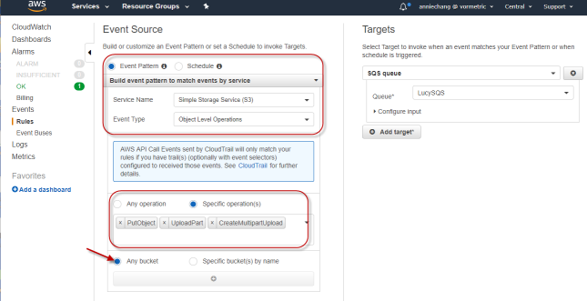

## Lucy cloudformation template to get customer onBoard

### create_auth.json
Purpose : Create roles and policy based on customer's google accountId to allow web identification federation from Lucy

### create_monitor.json
Purpose: create cloudTrail, cloudWatch , SQS such that event logs can be pushed to SQS when S3 objects updated.

To-Be-Decided:
- S3 buckets : currenty we are monitoring all S3 bucket. This is not pracical. We need a way to allow customer to select S3 bucket
 * option1: create a UI to setup and updating buckets ( it is a little bit complicate though)  
 * option2: customer provide provide us list of bucket before we provide formation scripts (how about updating?)
 * option3: default choose zero bucket. Customer use aws console cloudwatch-> event rules --> edit event to add bucket. Recommanded approach. Since cutomer might need to use the same way to update bucket in the future
- cloudTrail created logs by default stores for 7 days. Bucket *remains* after cloudformation delete stack
- SQS logging is currently allow all account (*) to post event. should this be restricted ? 

